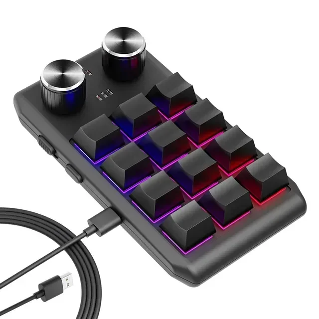

[English](README.md) | Português | [Español](README.es.md)

# CH57x Deck

**Frontend gráfico (Qt/PySide6) para o
[ch57x-keyboard-tool](https://github.com/kriomant/ch57x-keyboard-tool)** — o
CH57x Deck não fala com o macropad diretamente; ele monta a configuração numa
interface visual e delega toda a comunicação USB (validação e gravação) para
esse binário de linha de comando, chamando-o como subprocesso. Sem o
ch57x-keyboard-tool instalado, o app roda mas não consegue gravar nada (por
isso ele oferece instalá-lo automaticamente — veja "Requisitos").

Serve para configurar macropads baseados no chip CH57x (VID USB `1189`,
PIDs `8840`/`8842`/`8890` — os modelos genéricos de 3/6/9/12/15 teclas com
knobs). A gravação é feita **no firmware do dispositivo**: depois de enviar,
o mapeamento funciona em qualquer computador, sem precisar deste app nem de
um daemon rodando.

## Hardware



A unidade da foto é um macropad CH57x genérico com RGB, dois knobs e cabo
USB destacável — esse tipo de dispositivo, vendido sob várias marcas
diferentes, é o alvo do CH57x Deck.

### Modelos suportados

O menu **Modelo** troca o layout da interface entre as variantes genéricas
do chip CH57x:

| Modelo | Grade | Knobs | Situação |
| --- | --- | --- | --- |
| 3 teclas + 1 knob | 1 × 3 | 1 | ⚠ não testado |
| 6 teclas + 1 knob | 2 × 3 | 1 | ⚠ não testado |
| 9 teclas + 1 knob | 3 × 3 | 1 | ⚠ não testado |
| **12 teclas + 2 knobs** | **3 × 4** | **2** | **✅ testado** |
| 15 teclas + 2 knobs | 3 × 5 | 2 | ⚠ não testado |

> **Aviso:** até agora só o modelo de **12 teclas + 2 knobs** foi testado com
> hardware real — é o padrão ao abrir o app. As outras variantes já têm o
> frontend pronto, mas ainda **não foram testadas**; o arranjo de linhas ×
> colunas de cada uma é presumido. Se o preset não corresponder ao seu
> dispositivo, ajuste linhas, colunas e número de knobs à mão em
> **Modelo → Personalizado…**. Relatos de quem testou os demais modelos são
> bem-vindos.

## Requisitos

- Linux com systemd/udev (Fedora, Ubuntu/Debian, Arch, openSUSE…)
- Python 3.10+
- O PySide6 instalado via pip exige **glibc ≥ 2.34** (o wheel embute o
  próprio Qt, e esse é o piso dele). Satisfeito pelas versões atuais —
  Fedora 35+, Ubuntu 22.04+, Debian 12+, RHEL/Rocky/Alma 9+, Arch, openSUSE
  Tumbleweed. Em LTS mais antigas ainda em uso (Ubuntu 20.04, Debian 11,
  RHEL/Rocky/Alma 8), instale o PySide6 pelo pacote da própria distro em
  vez do pip — ex.: `apt install python3-pyside6.qtwidgets`, `dnf install
  python3-pyside6`, `pacman -S pyside6` — e então instale o CH57x Deck
  normalmente; ele detecta e reaproveita essa cópia em vez de baixar o
  wheel do pip.
- `ch57x-keyboard-tool`: se não estiver no PATH, o próprio app oferece
  baixar a release oficial na primeira execução (para
  `~/.local/share/ch57x_deck/bin`). O download é **conferido por SHA-256**
  contra um hash embutido antes de rodar — nunca executa um binário não
  verificado. Em **Ajuda → Atualizar ch57x-keyboard-tool…** dá para ver a
  versão instalada, (re)instalar a versão estável verificada e checar no
  GitHub se saiu uma estável nova.

## Instalação

Num comando (baixa o projeto e instala):

```bash
curl -fsSL https://raw.githubusercontent.com/PericlesSavio/ch57x_deck/main/install.sh | sh
```

Ou, a partir de um clone do repositório:

```bash
./install.sh
```

> Rodar um script direto da internet executa código remoto sem revisão. Se
> preferir conferir antes, baixe primeiro e leia: `curl -fsSL .../install.sh
> -o install.sh`, revise, e então `sh install.sh`.

Instala o app (pip, nível de usuário, sem root), o ícone e o atalho no menu
de aplicativos e — perguntando antes — a regra udev para acesso USB sem
root. Roda como usuário comum; o `sudo` só é usado nesse último passo,
opcional. Para remover tudo que foi instalado:

```bash
./install.sh --uninstall
```

(pergunta antes de apagar sua configuração salva; o resto é removido sem
perguntar).

### Instalação manual

Se preferir fazer na mão, ou só quiser o comando `ch57x-deck` sem a
integração com o desktop:

```bash
pip install --user .
```

Isso instala as dependências (PySide6, PyYAML) e cria o comando `ch57x-deck`
em `~/.local/bin` (precisa estar no `PATH`, o que já é o padrão na maioria
das distros). Como não é editável, a instalação não fica presa a este
diretório — dá para apagar o clone depois. Para desenvolvimento, use
`pip install --user -e .`: o `-e` deixa o pacote "editável", então alterações
nos arquivos em `macropad/` valem na hora, sem reinstalar.

<details>
<summary>Ícone, atalho de menu e permissão USB, na mão</summary>

```bash
# Ícone e atalho no menu de aplicativos
cp assets/ch57x-deck.svg ~/.local/share/icons/hicolor/scalable/apps/
cp assets/ch57x-deck.desktop ~/.local/share/applications/
gtk-update-icon-cache ~/.local/share/icons/hicolor 2>/dev/null
update-desktop-database ~/.local/share/applications 2>/dev/null

# Permissão USB (root, uma vez só)
sudo cp udev/70-macropad-ch57x.rules /etc/udev/rules.d/
sudo udevadm control --reload-rules && sudo udevadm trigger
```

O app também oferece instalar a regra udev sozinho, via `pkexec`, se
detectar o macropad sem permissão.

</details>

## Uso

```bash
ch57x-deck
```

Sem instalar (ex.: só para testar), também dá para rodar direto do
repositório com `python run.py`.

1. Escolha a **camada** (o macropad tem 3, alternadas pelo botão lateral).
2. Clique numa **tecla ou função de knob** na grade.
3. Monte a ação no editor:
   - **Teclado** — modificadores + tecla; até 5 passos encadeados (macro). O
     layout físico do teclado visual (ABNT2, AZERTY, QWERTZ…) é escolhido no
     menu **Teclado** — a tecla sempre grava a posição física (HID); é o
     layout do seu sistema operacional que decide o caractere final.
   - **Mídia** — play/pause, volume etc. (o firmware não permite
     modificadores junto com mídia).
   - **Avançado** — expressão livre: mouse (`click(left)`, `wheel(-1)`),
     código bruto (`<110>`), macros manuais (`ctrl-c,ctrl-v`).
4. **Validar** confere o YAML; **Enviar ao macropad** grava no firmware.

A última configuração enviada fica em `~/.config/ch57x_deck/current.yaml`
(e é recarregada ao abrir o app). `Arquivo → Salvar/Abrir` exporta e importa
YAML compatível com o `ch57x-keyboard-tool` puro.

## Planos futuros

- **Confirmar as variantes de 3/6/9/15 teclas com hardware real.** A interface
  já reconstrói a grade e oferece o menu **Modelo** (a geometria não é
  detectável via USB), mas só o modelo de 12 teclas + 2 knobs foi testado —
  ver "Modelos suportados". O mesmo vale para os layouts de teclado além do
  ABNT2 (menu **Teclado**): seguem o mapeamento padrão de cada layout, mas não
  foram conferidos.
- **Perfis nomeados.** Hoje só existe uma configuração autosalva
  (`current.yaml`); `Arquivo → Salvar/Abrir` cobre import/export manual, mas
  não uma troca rápida entre perfis (ex.: "Trabalho" vs. "Jogo") direto no
  menu.
- **Empacotamento para as distros** (`.deb`/`.rpm`/PKGBUILD ou Flatpak),
  além do `install.sh` a partir do fonte que já existe.

### Limitação conhecida (não é possível hoje)

**Ler o mapeamento já gravado no macropad.** O `ch57x-keyboard-tool` só
expõe `upload` (gravar), não um comando de leitura — não dá para "importar"
o que já está no dispositivo, só reconstruir a partir de um YAML salvo
localmente.

## Estrutura

| Arquivo | Papel |
| --- | --- |
| `macropad/model.py` | Config em memória + (de)serialização YAML |
| `macropad/keys.py` | Catálogo de teclas/modificadores do firmware |
| `macropad/backend.py` | Chama o ch57x-keyboard-tool; detecta USB via sysfs |
| `macropad/tool_manager.py` | Diálogo de instalar/atualizar o binário (verifica SHA-256) |
| `macropad/action_editor.py` | Widget de edição de uma ação |
| `macropad/keyboard_widget.py` | Teclado visual clicável |
| `macropad/layouts.py` | Layouts físicos do teclado (ABNT2, AZERTY…) |
| `macropad/test_area.py` | Área de teste (captura o que o pad envia) |
| `macropad/main_window.py` | Janela principal |
| `macropad/i18n.py` | Traduções (pt-BR, en, es) |
| `macropad/settings.py` | Preferências persistentes |
| `macropad/theme.py` | Tema Monokai + claro; segue o tema do sistema |
| `tests/` | Testes de lógica pura (pytest, sem hardware nem Qt) |
| `udev/70-macropad-ch57x.rules` | Regra de permissão USB |
| `pyproject.toml` | Empacotamento; gera o comando `ch57x-deck` |
| `assets/ch57x-deck.svg` | Ícone do app (paleta do `theme.py`) |
| `assets/ch57x-deck.desktop` | Atalho para o menu de aplicativos |
| `install.sh` | Instalação/remoção num passo só (`--uninstall`) |
| `packaging/ch57x-deck-uninstall` | Desinstalação autocontida, chamada por `install.sh --uninstall` |
| `scripts/pin_release.py` | Manutenção: fixa o SHA-256 de uma nova versão estável do binário |
| `LICENSE` | Texto da GPL-3.0 |

## Testes

Os testes cobrem a lógica pura (modelo/YAML, teclas, layouts, traduções,
tema) — sem hardware nem interface gráfica:

```bash
pip install --user '.[dev]'   # instala o pytest
pytest
```

## Licença

[GPL-3.0-or-later](LICENSE). O CH57x Deck fala com o macropad **apenas** pelo
`ch57x-keyboard-tool`, chamando-o como subprocesso (sem linkar o código dele),
então essa escolha de licença não impõe nada a esse projeto separado.
